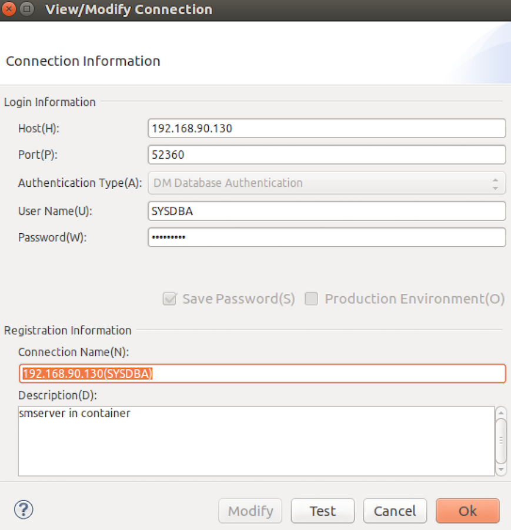
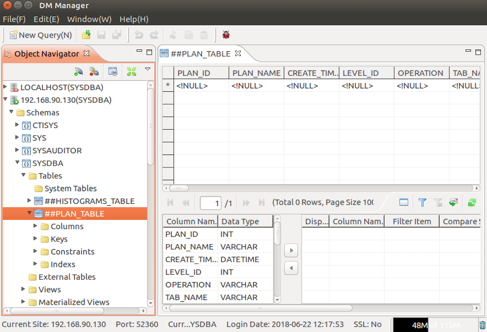

达梦数据库容器化
----------------------------

# 准备

## 下载安装包
从 http://www.dameng.com/down.aspx 下载`DM7开发版（linux64位）`

## 提取DMInstall.bin

## 启动简易http服务

> 提供下载链接 http://<host_ip>:8000/DMInstall.bin,以便build docker镜像时，从该url下载安装文件到build容器中  
> 容器中，安装完删除安装包，以减小docker镜像大小
```
$ ll DMInstall.bin
-r-x--x--x 1 osboxes osboxes 466M Jun 21 11:17 DMInstall.bin

// 在另一个终端中运行
$ python -m SimpleHTTPServer
Serving HTTP on 0.0.0.0 port 8000 ...
或者
// 同一个终端中运行
$ screen -S http -L -d -m bash -c "python -m SimpleHTTPServer"
```

# 构建docker镜像

```
$ ./build.sh
Sending build context to Docker daemon  1.828MB
Step 1/8 : FROM centos:7
 ---> 49f7960eb7e4
Step 2/8 : MAINTAINER Jimmy Xu <jimmy@hyper.sh>
 ---> Using cache
 ---> 3df30e593814
Step 3/8 : ARG DOWNLOAD_URL
 ---> Using cache
 ---> 95b7c591f5e1
Step 4/8 : RUN yum install -y openssl openssl-devel e2fsprogs
 ---> Using cache
 ---> f5d14662657c
Step 5/8 : ADD etc/config.xml /tmp/config.xml
 ---> Using cache
 ---> 24c3a9ac9025
Step 6/8 : RUN mkdir -p /opt/dm;     curl -O --progress-bar -o DMInstall.bin $DOWNLOAD_URL;     chmod +x ./DMInstall.bin;     ./DMInstall.bin -q /tmp/config.xml;    rm -rf DMInstall.bin
 ---> Using cache
 ---> 460d82ba3088
Step 7/8 : EXPOSE 5236
 ---> Using cache
 ---> e0ee69a29791
Step 8/8 : CMD ["/opt/dm/bin/dmserver", "/opt/dm/data/DAMENG/dm.ini", "-noconsole"]
 ---> Using cache
 ---> cc285af8cf25
Successfully built cc285af8cf25
Successfully tagged hyperhq/dmserver:x86
```

# 运行容器

```
//查看docker镜像
$ docker images
REPOSITORY              TAG         IMAGE ID            CREATED             SIZE
hyperhq/dmserver        x86         cc285af8cf25        11 minutes ago      1.84GB

//启动docker容器
$ docker run -d --name dmserver -p 52360:5236 hyperhq/dmserver:x86

//查看docker容器
$ docker ps
CONTAINER ID   IMAGE                  COMMAND                  CREATED         STATUS         PORTS                     NAMES
a8b10481bd0b   hyperhq/dmserver:x86   "/opt/dm/bin/dmserve…"   4 minutes ago   Up 4 minutes   0.0.0.0:52360->5236/tcp   dmserver
```

# 使用DM Manager连接服务端

> 192.168.90.130为宿主机的ip, 52360容器dmserver映射到宿主机的port




